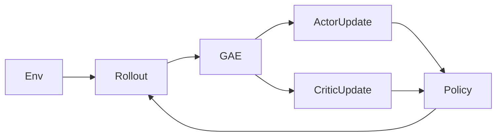
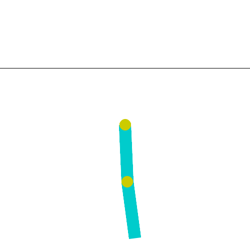

# A2C — Advantage Actor-Critic for Acrobot

PyTorch implementation of **Advantage Actor-Critic (A2C)** trained on [Gymnasium](https://gymnasium.farama.org/) `Acrobot-v1`. The agent learns to swing the acrobot up and balance it using separate actor and critic networks, Generalized Advantage Estimation (GAE), and on-policy rollouts batched across multiple episodes per update.

## Features

- **Actor–critic architecture** — Shared MLP backbone with orthogonal initialization; actor outputs a categorical policy, critic predicts state values.
- **GAE (λ)** — Advantage and return targets computed per episode, with bootstrap value on truncation.
- **Separate optimizers** — Different learning rates for actor (`7e-4`) and critic (`3e-3`) to keep policy updates stable while the value function tracks returns.
- **Entropy bonus** — Encourages exploration during training.
- **Gradient clipping** — Applied independently to actor and critic parameters.
- **Evaluation & visualization** — Rollout GIFs before/after training, mean ± std reward over evaluation episodes, and learning curves saved to disk.

## Project structure

```
A2C/
├── a2c.py          # Networks, GAE, training loop, main entry point
├── a2c_eval.py     # Evaluation helpers (GIF export, metrics, plots)
├── setup.sh        # Creates venv and installs core dependencies
└── venv/           # Local virtual environment (created by setup.sh)
```


## Requirements

- Python 3.12 (the provided `setup.sh` uses Homebrew’s `/opt/homebrew/bin/python3.12`)
- Core: `torch`, `gymnasium`, `gym`, `pygame`
- Evaluation/plotting: `numpy`, `matplotlib`, `imageio` (and `pillow` for GIF writing)

Tested with PyTorch 2.12 and Gymnasium 1.3 in the project venv.

## Installation

### Quick setup (macOS / Homebrew Python)

```bash
chmod +x setup.sh
./setup.sh
source venv/bin/activate
pip install numpy matplotlib imageio pillow
```

### Manual setup

```bash
python3.12 -m venv venv
source venv/bin/activate
pip install --upgrade pip
pip install torch gymnasium gym pygame numpy matplotlib imageio pillow
```

CUDA is used automatically when available; otherwise training runs on CPU.

## Usage

Train on `Acrobot-v1` with default hyperparameters:

```bash
source venv/bin/activate
python a2c.py
```

The script will:

1. Record a short GIF of the **untrained** policy → `acrobot_start.gif`
2. Run **3,000 updates** (8 episodes per update, up to 500 steps each)
3. Print rolling average score, actor loss, entropy, and value statistics every 20 updates
4. Evaluate over **100 episodes** and print mean ± std reward
5. Record a GIF of the **trained** policy → `acrobot_end.gif`
6. Save learning curves → `learning_and_scores_curves.png`

## Configuration

Hyperparameters live in the `Args` dataclass at the top of `a2c.py`:

| Parameter | Default | Description |
|-----------|---------|-------------|
| `env_id` | `Acrobot-v1` | Gymnasium environment |
| `n_updates` | `3000` | Number of policy update steps |
| `episodes_per_update` | `8` | Episodes collected before each update |
| `n_evaluation_episodes` | `100` | Episodes for final evaluation |
| `max_t` | `500` | Max steps per episode |
| `gamma` | `0.99` | Discount factor |
| `gae_lambda` | `0.95` | GAE λ |
| `lr_actor` | `7e-4` | Actor learning rate |
| `lr_critic` | `3e-3` | Critic learning rate |
| `h_size` | `128` | Hidden layer size |
| `entropy_coef` | `0.01` | Entropy regularization weight |
| `max_grad_norm` | `0.5` | Gradient clipping threshold |
| `normalize_adv` | `True` | Normalize advantages over the full batch |

Edit `Args()` in the `if __name__ == "__main__"` block or instantiate `Args` with overrides to experiment.

## Algorithm overview

Each update:

1. **Collect** `episodes_per_update` trajectories with the current policy.
2. **Compute** advantages and returns with GAE; bootstrap the critic at the final state when an episode is truncated but not terminated.
3. **Normalize** advantages across the concatenated batch (not per episode).
4. **Update actor** — Policy gradient on log-probabilities weighted by advantages, minus entropy bonus.
5. **Update critic** — MSE between predicted values and GAE returns.



## Outputs

| File | Description |
|------|-------------|
| `acrobot_start.gif` | Random / untrained agent behavior |
| `acrobot_end.gif` | Trained agent behavior |
| `learning_and_scores_curves.png` | Episode rewards and actor loss vs. episode |

## Results

Trained for **3,000 updates** (24,000 episodes total) on CPU with default hyperparameters.

### Agent behavior

| Before training | After training |
|:-:|:-:|
|  |  |

### Training log (final 20 checkpoints)

```
Update  2620 ( 20960 eps) | Avg Score:    -83.2 | Actor Loss:  -0.002 | Entropy:    0.0596 | V(s):         -30.7 | V target:     -31.1
Update  2640 ( 21120 eps) | Avg Score:    -83.6 | Actor Loss:  -0.006 | Entropy:    0.0623 | V(s):         -34.3 | V target:     -32.7
Update  2660 ( 21280 eps) | Avg Score:    -83.0 | Actor Loss:  -0.001 | Entropy:    0.0652 | V(s):         -27.6 | V target:     -30.7
Update  2680 ( 21440 eps) | Avg Score:    -85.0 | Actor Loss:  -0.005 | Entropy:    0.0703 | V(s):         -31.9 | V target:     -31.2
Update  2700 ( 21600 eps) | Avg Score:    -81.4 | Actor Loss:  -0.003 | Entropy:    0.0694 | V(s):         -31.2 | V target:     -31.0
Update  2720 ( 21760 eps) | Avg Score:    -80.4 | Actor Loss:  -0.000 | Entropy:    0.0804 | V(s):         -29.7 | V target:     -30.1
Update  2740 ( 21920 eps) | Avg Score:    -77.7 | Actor Loss:  -0.006 | Entropy:    0.0859 | V(s):         -30.6 | V target:     -30.4
Update  2760 ( 22080 eps) | Avg Score:    -80.6 | Actor Loss:  -0.003 | Entropy:    0.0734 | V(s):         -31.3 | V target:     -30.6
Update  2780 ( 22240 eps) | Avg Score:    -81.2 | Actor Loss:  -0.006 | Entropy:    0.0720 | V(s):         -30.7 | V target:     -30.4
Update  2800 ( 22400 eps) | Avg Score:    -85.0 | Actor Loss:  -0.012 | Entropy:    0.0722 | V(s):         -33.2 | V target:     -32.4
Update  2820 ( 22560 eps) | Avg Score:    -81.0 | Actor Loss:  -0.003 | Entropy:    0.0662 | V(s):         -32.3 | V target:     -31.8
Update  2840 ( 22720 eps) | Avg Score:    -85.9 | Actor Loss:  -0.006 | Entropy:    0.0612 | V(s):         -30.1 | V target:     -32.1
Update  2860 ( 22880 eps) | Avg Score:    -77.8 | Actor Loss:  -0.004 | Entropy:    0.0655 | V(s):         -29.3 | V target:     -30.0
Update  2880 ( 23040 eps) | Avg Score:    -82.1 | Actor Loss:  -0.004 | Entropy:    0.0661 | V(s):         -32.3 | V target:     -33.0
Update  2900 ( 23200 eps) | Avg Score:    -88.8 | Actor Loss:   0.004 | Entropy:    0.0596 | V(s):         -31.7 | V target:     -33.2
Update  2920 ( 23360 eps) | Avg Score:    -76.9 | Actor Loss:  -0.010 | Entropy:    0.0601 | V(s):         -29.2 | V target:     -29.2
Update  2940 ( 23520 eps) | Avg Score:    -85.8 | Actor Loss:  -0.007 | Entropy:    0.0653 | V(s):         -32.6 | V target:     -32.6
Update  2960 ( 23680 eps) | Avg Score:    -83.5 | Actor Loss:   0.000 | Entropy:    0.0680 | V(s):         -32.1 | V target:     -31.2
Update  2980 ( 23840 eps) | Avg Score:    -81.9 | Actor Loss:  -0.006 | Entropy:    0.0555 | V(s):         -32.8 | V target:     -31.9
Update  3000 ( 24000 eps) | Avg Score:    -80.6 | Actor Loss:  -0.004 | Entropy:    0.0650 | V(s):         -31.4 | V target:     -31.4

Mean reward (100 eps): -76.38 ± 14.34
```

The agent converges to an average episode length well below the 500-step cap, which in `Acrobot-v1` (reward = −1 per step) corresponds to solving the task in ~76 steps on average.


